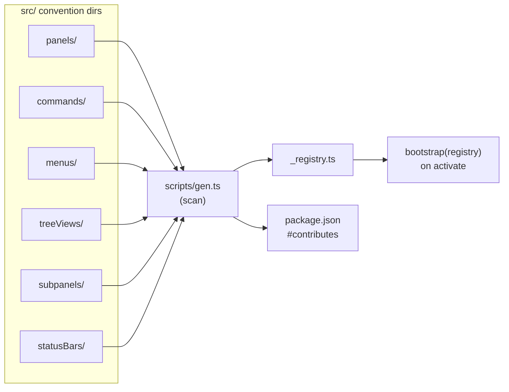
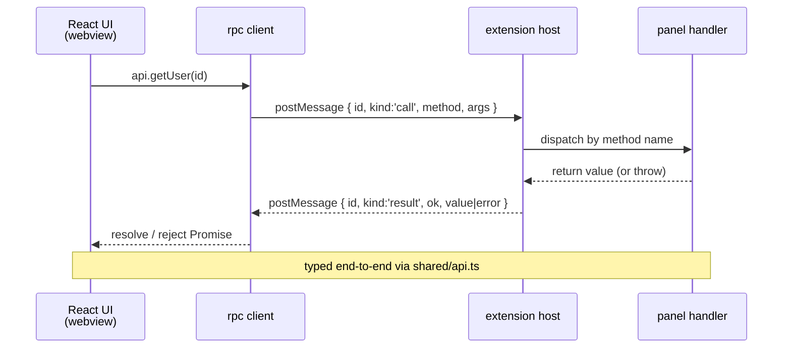

# vsceasy — Architecture

Goal: build VS Code extensions fast with zero boilerplate for panels, webview UI, RPC, menus, tree views, status bar items, and subpanels.

## Pieces

```
vsceasy
├── CLI            → scaffold + generators (create, panel|menu|command|rpc|treeview|… add)
├── lib/           → pure generator functions (no CLI deps)
├── templates/
│   ├── react/     → the project template (the only supported UI for now)
│   └── _generators → snippet templates used by `<group> add`
└── doctor / upgrade — diagnose drift + sync framework files
```

Public TS API is `src/index.ts` (re-exports `./lib`). Generated projects copy `src/shared/vsceasy/` from the template — `vsceasy upgrade` syncs that runtime in place.

## Generated project layout

```
my-extension/
├── src/
│   ├── extension/
│   │   ├── extension.ts        # bootstrap(registry) — wires VS Code on activate
│   │   └── _registry.ts        # AUTO-GENERATED by `bun run gen`
│   ├── panels/<name>.ts        # one file = one webview panel (definePanel)
│   ├── commands/<name>.ts      # one file = one palette command (defineCommand)
│   ├── menus/<name>.ts         # activity-bar container + items (defineMenu)
│   ├── treeViews/<name>.ts     # data-driven tree view (defineTreeView)
│   ├── subpanels/<name>.ts     # inline webview section inside a menu (defineSubpanel)
│   ├── statusBars/<name>.ts    # status bar item (defineStatusBar)
│   ├── webview/                # React bundles (per panel + per subpanel)
│   └── shared/
│       ├── api.ts              # RPC contracts (interface per panel)
│       └── vsceasy/            # framework runtime — synced via `vsceasy upgrade`
├── .vscode/launch.json         # Extension Development Host launch
├── vite.config.ts              # webview build
└── package.json                # esbuild for extension, vite for UI
```

## File-based registry



`scripts/gen.ts` scans the convention dirs:

| Dir              | API              | Becomes …                                       |
|------------------|------------------|-------------------------------------------------|
| `panels/`        | `definePanel`    | webview panel + auto `<prefix>.open<Name>` cmd |
| `commands/`      | `defineCommand`  | palette command + keybindings                  |
| `menus/`         | `defineMenu`     | activity-bar viewContainer + tree view         |
| `treeViews/`     | `defineTreeView` | data-driven view inside a menu container       |
| `subpanels/`     | `defineSubpanel` | inline webview section inside a menu           |
| `statusBars/`    | `defineStatusBar`| status bar item                                |

`gen` writes `src/extension/_registry.ts` and syncs `package.json#contributes` (commands, keybindings, viewsContainers, views) to match what's on disk.

## RPC bridge

Transport: `webview.postMessage` + `acquireVsCodeApi`.



Protocol:
```
{ id: string, kind: 'call', method: string, args: unknown[] }
{ id: string, kind: 'result', ok: true, value: unknown }
{ id: string, kind: 'result', ok: false, error: { message, stack? } }
```

Client API: `api.<method>(...args)` — typed end-to-end via the shared interface in `src/shared/api.ts`. No manual `postMessage`.

## Build pipeline

- Extension code → `esbuild` → `dist/extension.js` (CJS, node target)
- Each panel/subpanel UI → `vite build` → `dist/webview/<kind>/<name>/`
- `bun run dev` runs both in watch; F5 launches the Extension Development Host with the bundled launch config.
- `bun run package` → `.vsix` via `@vscode/vsce`.

## Activation events

`onStartupFinished` is enough — bootstrap registers everything from the generated registry on activate, so there's no need to maintain `activationEvents` per command.

## Theming

CSS variables from the VS Code theme are injected into the webview root automatically. Use them directly (`var(--vscode-foreground)`) or wrap with your styling solution of choice.

## What we explicitly don't do

- No bundler abstraction — Vite + esbuild only.
- No state-management opinions — userland choice.
- No language-server abstraction (write LSP code with `vscode-languageclient` directly).

## Roadmap

- v0.1 (this release): React UI, RPC, all generators, tree views, test/publish helpers.
- v0.2: language-server template, multi-panel hot reload, more presets.
- v0.3: optional alt UI runtimes (Svelte/Vue) if there's demand.
