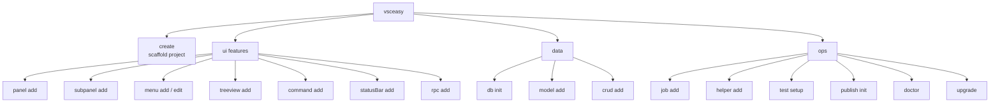

# vsceasy

Build VS Code extensions fast. React UI + typed RPC bridge between extension and webview + zero-config build.

> Status: v0.1 — React UI. Typed RPC bridge + file-based registry + scaffolding for panels, commands, menus, tree views, subpanels, status bars.

## Quick start

```bash
bunx vsceasy create my-extension
cd my-extension
bun install
bun run dev
# press F5 in VS Code to launch the Extension Development Host
```

Or with flags:

```bash
bunx vsceasy create \
  --name my-extension \
  --displayName "My Extension" \
  --description "Does cool things" \
  --publisher my-publisher \
  --ui react
```

## What you get

```
my-extension/
├── src/
│   ├── extension/
│   │   ├── extension.ts            # entry, command registration
│   │   └── panels/DashboardPanel.ts # webview panel + RPC handlers
│   ├── webview/
│   │   ├── App.tsx                 # React UI (typed RPC client)
│   │   ├── main.tsx
│   │   └── styles.css              # VS Code theme tokens
│   └── shared/
│       ├── api.ts                  # RPC contract (types both sides)
│       └── rpc.ts                  # bridge implementation
├── vite.config.ts                  # webview build
└── package.json                    # esbuild for extension, vite for UI
```

## Command map



Run `vsceasy <group> <subcommand> --help` for details on any command.

## Typed RPC

Define the contract once:

```ts
// src/shared/api.ts
export interface DashboardApi {
  listFiles(pattern: string): Promise<string[]>;
}
```

Extension side — implement:

```ts
const handlers: DashboardApi = {
  async listFiles(pattern) {
    const uris = await vscode.workspace.findFiles(pattern);
    return uris.map(u => vscode.workspace.asRelativePath(u));
  },
};
createRpcServer(webviewTransport(panel.webview), handlers);
```

Webview side — call with full type inference:

```tsx
const api = createRpcClient<DashboardApi>(vscodeApiTransport(vscode));
const files = await api.listFiles('**/*.ts');  // typed string[]
```

No manual `postMessage`. No string-typed message channels.

## CLI commands

Structure: `vsceasy <resource> <verb> [flags]`. Every command runs interactively when flags are omitted (banner + per-param prompts) or fully scripted via flags.

New to the project? Run the guided wizard:

```bash
vsceasy wizard
```

It detects whether you're inside a vsceasy project — outside it walks you through `create`, inside it menus the common generators (panel, command, database, model, helper) and points you at the rest.

```
vsceasy
├── wizard              interactive guided flow (create or add features)
├── create              scaffold a new extension project
├── panel
│   └── add             new webview panel + optional typed RPC (opens in editor area)
├── menu
│   ├── add             new sidebar tree view (activity bar)
│   └── edit            add an item (panel / command / url / group)
├── command
│   └── add             new palette command (with optional menu entry + keybinding)
├── rpc
│   └── add             add a typed RPC method to a panel
├── statusBar
│   └── add             status bar item → command / panel / menu popup
├── subpanel
│   └── add             inline sidebar section (lives under a menu container)
├── treeview
│   └── add             data-driven tree view (getChildren/getTreeItem) under a menu
├── test
│   └── setup           Vitest config + sample test + vscode/RPC mock helpers
├── publish
│   └── init            marketplace preflight (README, CHANGELOG, icon, vsce ls)
├── helper
│   └── add             generate runtime helper (secrets | config | state | notifications)
├── job
│   └── add             recurring / event-triggered job (interval | dailyAt | on event | onFile)
├── db
│   └── init            scaffold project database (mini-ORM)  at src/helpers/db.ts
├── model
│   └── add             typed entity + repo under src/models/
├── crud
│   └── add             full CRUD scaffold (service + list panel + form panel + menu wire)
├── doctor              diagnose project + safe --fix
└── upgrade             sync framework-owned files from the bundled templates
```

Run `vsceasy <resource> --help` for verbs and `vsceasy <resource> <verb> --help` for params.

### `panel add`
```bash
vsceasy panel add --name settings --title "Settings" --withApi yes
```
Generates `src/panels/<name>.ts` + `src/webview/panels/<name>/{App.tsx,main.tsx}` + appends `<Name>Api` to `src/shared/api.ts` when `withApi=yes`.

### `command add`
```bash
vsceasy command add \
  --name doStuff \
  --title "Do Stuff" \
  --menuEntry main \
  --group "Actions" \
  --icon play \
  --keybinding "ctrl+shift+h" \
  --when "editorTextFocus && resourceLangId == typescript"
```
`--when` writes a VS Code `when` clause that controls palette enablement + auto-injects `contributes.menus.commandPalette` so the command is hidden when the context doesn't match. See [when-clause contexts](https://code.visualstudio.com/api/references/when-clause-contexts).
For richer keybindings (mac override / `when` clause) edit the generated file:
```ts
keybinding: { key: 'ctrl+shift+h', mac: 'cmd+shift+h', when: 'editorTextFocus' }
// or an array
keybinding: ['ctrl+a', { key: 'ctrl+b', mac: 'cmd+b' }]
```

### `menu add`
Sidebar tree view. Icon picker is searchable across 186+ codicons.
```bash
vsceasy menu add --name main --title "My Tools" --icon rocket
```

### `menu edit`
Add an item to an existing menu — opens a panel, runs a command, opens a URL, or creates a collapsible group. Conditional prompts adapt to the chosen item kind.
```bash
vsceasy menu edit --name main --kind panel --panel dashboard --label "Dashboard" --icon window
```

### `rpc add`
Extends `src/shared/api.ts` (creates the interface if missing) + inserts a handler stub into the panel (creates the `rpc:` block if missing). Auto-adds `import type` + `definePanel<…Api>` generic when needed.
```bash
vsceasy rpc add --panel dashboard --method getCount --params "limit: number" --returns "number"
```

### `statusBar add`
Bind to a command, panel, or popup menu (QuickPick). Markdown tooltip available (Copilot/GitLens-style hover).
```bash
# existing command
vsceasy statusBar add --name buildBtn --text Build --bindTo command --command hello --icon tools

# panel (auto-wires <prefix>.open<Panel>)
vsceasy statusBar add --name openDash --text Dashboard --bindTo panel --panel dashboard

# bootstrap new command + status bar together
vsceasy statusBar add --name sync --text Sync --bindTo "create new command" --newCommandTitle "Run Sync"

# popup menu — interactive loop builds each item
vsceasy statusBar add --name tools --text Tools --bindTo menu
```
Rich markdown tooltip:
```bash
vsceasy statusBar add \
  --name copilotPro --text "Copilot Pro" --icon copilot \
  --bindTo panel --panel dashboard \
  --tooltipMarkdown "### Copilot Pro\n\n**18% used**\n\n[Upgrade](command:myext.openDashboard)"
```

### `subpanel add`
Inline sidebar section (the GitLens / Copilot pattern — collapsible webview that lives inside a menu container). Each subpanel becomes a new section under the chosen activity-bar menu, stacked alongside the tree view and any other sibling subpanels.

```bash
vsceasy subpanel add --name welcome --menu main --title "Welcome" --withApi yes
```

Files:
- `src/subpanels/<name>.ts` (defineSubpanel with `menu: '<container>'`)
- `src/webview/subpanels/<name>/{App.tsx,main.tsx}` (React bundle)
- `<Name>ViewApi` appended to `src/shared/api.ts` when `withApi=yes`

Multiple subpanels can reference the same `menu` — they render as stacked collapsible sections in that container.

### `doctor`
Diagnose engine, scripts, panels, RPC contract sync, menu refs, codicons, status bar refs, package.json `contributes` drift, `.gitignore`.
```bash
vsceasy doctor             # report
vsceasy doctor --fix=true  # auto-fix: missing RPC handler stubs, orphan menu items, .gitignore entries
```

### `upgrade`
Sync framework-owned files (`src/shared/vsceasy/*`, `scripts/gen.ts`) from the bundled templates. Use after upgrading `vsceasy`.
```bash
vsceasy upgrade              # dry-run
vsceasy upgrade --apply=true # write + auto-run `bun run gen`
```

### `treeview add`
Data-driven tree view inside an existing menu container. Lazy children via `getChildren`. Built-in dispatch for `run` / `panel` / `command` on click.
```bash
vsceasy treeview add --name explorer --menu main --title "Explorer"
```
Generates `src/treeViews/<name>.ts`. Refresh from anywhere: `vscode.commands.executeCommand('<prefix>._tree.<name>.refresh')`.

### `test setup`
Drops a `vitest.config.ts`, a sample `src/__tests__/sample.test.ts`, and `src/__tests__/_helpers.ts` with `mockVscode()`, `mockContext()`, and `mockRpcPair<H>()` for end-to-end handler tests. Also adds `test` / `test:watch` scripts + `vitest` devDep.
```bash
vsceasy test setup
bun install && bun run test
```

Example:
```ts
import { mockRpcPair } from './_helpers';
import type { DashboardApi } from '../shared/api';

const handlers: DashboardApi = { async listFiles() { return ['a.ts']; } };
const api = mockRpcPair<DashboardApi>(handlers);
expect(await api.listFiles('**/*.ts')).toEqual(['a.ts']);
```

### `job add`
Recurring or event-triggered background work. Runtime handles registration, cleanup on deactivate, and error isolation. Optional `--minIntervalMs` throttles re-runs across triggers (persisted in `context.globalState`).
```bash
# every 60s, runs on startup
vsceasy job add --name sync --every 60s

# at 02:30 local time daily
vsceasy job add --name nightlyIndex --dailyAt 02:30

# on document save (with at-most-once-per-hour throttle)
vsceasy job add --name lint --on saveDocument --minIntervalMs 3600000

# on filesystem changes (create | change | delete)
vsceasy job add --name reindexMd --onFile "**/*.md"

# event triggers: startup | saveDocument | openDocument | changeActiveEditor | changeConfig
```
`--every` accepts `30s`, `5m`, `2h`, `1d`, or a raw ms number. Jobs run only while the extension host is active — for cross-session schedules use OS cron or GitHub Actions.

### `helper add`
Generates typed wrappers into `src/helpers/`. Cuts boilerplate for the most-touched VS Code APIs + storage.
```bash
vsceasy helper add --kind secrets         # context.secrets — OS keychain
vsceasy helper add --kind config          # workspace.getConfiguration — typed
vsceasy helper add --kind state           # workspace + global mementos
vsceasy helper add --kind notifications   # toast + confirm + withProgress
vsceasy helper add --kind cache           # in-memory TTL + LRU + wrap()
# For ORM use the dedicated commands: `vsceasy db init` + `vsceasy model add`
```
For `secrets` and `state`, wire on activate:
```ts
import { initSecrets } from './helpers/secrets';
initSecrets(context);
```

### `db init` + `model add` (mini-ORM)
Typed entities, CRUD, transactions. Workflow:

```bash
# 1. one-time per project — creates src/helpers/db.ts
vsceasy db init                         # filesystem JSON under context.storageUri/db/
vsceasy db init --provider global       # or globalStorageUri (user-wide)

# 2. add models interactively — type `name:type` per line, empty to finish
vsceasy model add --name User
#   field 1: id:string!         (! = primary key)
#   field 2: name:string
#   field 3: email?:string@     (? = optional, @ = indexed)
#   field 4: createdAt:number
#   field 5:                    (enter to finish)

# 3. or in one shot
vsceasy model add --name Post --fields "id:string!,userId:string@,title:string,body:string"
```

Wire on activate (`src/extension/extension.ts`):
```ts
import { initDb } from '../helpers/db';
initDb(context);
```

Use:
```ts
import { UsersRepo } from '../models/User';

await UsersRepo().insert({ id: 'u1', name: 'Jairo', email: 'j@x.io', createdAt: Date.now() });
await UsersRepo().update('u1', { name: 'Jairo F' });
const u = await UsersRepo().findById('u1');
const recent = await UsersRepo().findMany({ orderBy: 'createdAt:desc', limit: 10 });
const matches = await UsersRepo().findMany({ where: { email: { in: ['a@x.io', 'b@x.io'] } } });
await UsersRepo().deleteMany({ email: 'spam@x.io' });

// Atomic — rolls back on throw
import { db } from '../helpers/db';
import { Users } from '../models/User';
await db().transaction(async (tx) => {
  await tx(Users).insert({ id: 'u2', name: 'A', email: 'a@x.io', createdAt: Date.now() });
  await tx(Users).update('u1', { name: 'B' });
});
```

Operators: `value` (eq), `{ in: [...] }`, `{ neq: value }`. `orderBy`: `'field:asc'` | `'field:desc'` | `'field'`.

Field-spec grammar (interactive loop + `--fields`):
- `name:type` — required field
- `name?:type` — optional
- `name:type!` — primary key (defaults to `id` or first field)
- `name:type@` — indexed
- combine: `score:number!@`

### `crud add` (Rails-style scaffold)
End-to-end CRUD UI for a model. Reads `src/models/X.ts`, generates:

```
src/services/UserService.ts        ← business logic between RPC and repo
src/panels/usersList.ts            ← list panel (RPC: list, delete, openForm)
src/panels/userForm.ts             ← form panel (RPC: get, save, cancel)
src/webview/panels/usersList/      ← React table w/ Edit + Delete buttons
src/webview/panels/userForm/       ← React form, inputs inferred from TS types
src/shared/api.ts                  ← appends UsersListApi + UserFormApi
src/menus/users.ts (optional)      ← if --menu new:users
```

Inputs auto-inferred:
- `string` → `<input type="text">`
- `number` → `<input type="number">`
- `boolean` → `<input type="checkbox">`
- `Date` → `<input type="date">`
- `'a' | 'b' | 'c'` → `<select>` with options
- `null | undefined` unions stripped before inference

```bash
# Interactive — picks menu policy (none | existing | new)
vsceasy crud add --model User

# Scripted
vsceasy crud add --model User --menu new:users
vsceasy crud add --model Post --menu existing:settings
vsceasy crud add --model Note --menu "(no menu)"
```

#### Custom overrides — `src/models/X.crud.ts`
Optional file next to your model:
```ts
export default {
  title: 'People',                       // display label
  icon: 'person',                        // codicon for menu
  hidden: ['createdAt'],                 // strip from list + form
  order: ['name', 'email', 'role'],      // explicit field order
  fields: {
    name: { label: 'Full name' },
    bio:  { input: 'textarea', placeholder: 'Short bio…' },
    role: { input: 'select', options: ['admin', 'editor', 'viewer'] },
    email: { hideInList: true },         // visible in form, hidden in table
  },
};
```

#### Cache
```ts
import { createCache } from './helpers/cache';

const cache = createCache<User>({ ttlMs: 60_000, max: 200 });
const u = await cache.wrap(`user:${id}`, () => orm(User).findById(id));
await cache.refresh(`user:${id}`, () => orm(User).findById(id)); // force reload
```
Concurrent `wrap()` calls for the same key share one in-flight loader.

### `publish init`
Marketplace preflight: writes `README.md`, `CHANGELOG.md`, an `assets/icon.png` placeholder, fills `repository` / `categories` / `icon` in package.json, and runs `npx @vscode/vsce ls` as a dry-pack.
```bash
vsceasy publish init
# fix any warnings, then:
npx @vscode/vsce package
npx @vscode/vsce publish
```

### Project config (`vsceasy.config.ts`)
Auto-generated by `vsceasy create`. Persists per-project defaults so generators don't re-prompt them.
```ts
import type { VsceasyConfig } from 'vsceasy';

const config: VsceasyConfig = {
  publisher: 'my-publisher',
  commandPrefix: 'myExt',
  ui: 'react',
  defaultCategory: 'My Extension', // used by `command add` when --category is omitted
  defaultIcon: 'rocket',           // used by `menu add` when --icon is omitted
};

export default config;
```

## Convention

Files in `src/{panels,commands,menus,statusBars,subpanels}/*.ts` are auto-discovered by `bun run gen`, which produces `src/extension/_registry.ts` and keeps `package.json#contributes` in sync. The framework's runtime (`bootstrap(registry)`) wires everything into VS Code on activation.

## Architecture

See [ARCHITECTURE.md](./ARCHITECTURE.md).

## License

MIT
