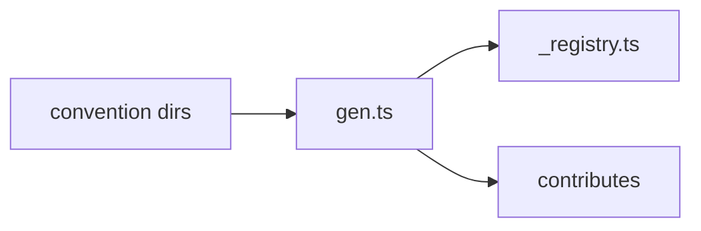

Four ideas explain almost everything vsceasy does.

## 1. Convention directories

Each feature type has a directory. A file in it *is* the feature.

| Directory      | API              | Becomes…                                       |
| -------------- | ---------------- | ---------------------------------------------- |
| `panels/`      | `definePanel`    | webview panel + auto `<prefix>.open<Name>` cmd |
| `commands/`    | `defineCommand`  | palette command + keybindings                  |
| `menus/`       | `defineMenu`     | activity-bar container + tree view             |
| `treeViews/`   | `defineTreeView` | data-driven view inside a menu container       |
| `subpanels/`   | `defineSubpanel` | inline webview section inside a menu           |
| `statusBars/`  | `defineStatusBar`| status bar item                                |

```ts title="src/panels/dashboard.ts"
import { definePanel } from '../shared/vsceasy';

export default definePanel({
  title: 'Dashboard',
});
```

## 2. The gen step

`scripts/gen.ts` scans those directories and writes two things:

- `src/extension/_registry.ts` — a typed registry of everything on disk.
- `package.json#contributes` — commands, keybindings, viewsContainers, views, all
  kept in sync with the files.

Run it with `bun run gen`. Generators run it for you after writing files.



## 3. Typed RPC

The webview talks to the extension through one typed interface.

```ts title="src/shared/api.ts"
export interface DashboardApi {
  getStats(): Promise<{ total: number }>;
}
```

```ts title="src/panels/dashboard.ts"
export default definePanel<DashboardApi>({
  title: 'Dashboard',
  rpc: (vscode) => ({
    async getStats() {
      return { total: 42 };
    },
  }),
});
```

```tsx title="src/webview/panels/dashboard/App.tsx"
import { connectWebview } from '../../../shared/vsceasy/client';
import type { DashboardApi } from '../../../shared/api';

const api = connectWebview<DashboardApi>();
const stats = await api.getStats(); // typed, no postMessage
```

See [Typed RPC](/guides/rpc/) for the full story.

## 4. Bootstrap

`extension.ts` is a one-liner. `bootstrap(registry)` registers everything from
the generated registry on activate, so you rarely touch activation events.

```ts title="src/extension/extension.ts"
import { bootstrap } from '../shared/vsceasy';
import { registry } from './_registry';

export const activate = bootstrap(registry, { onActivate: [/* initDb, … */] });
```

`onActivate` hooks run once on activate — wire `initDb(context)`,
`initSecrets(context)`, and similar there.
