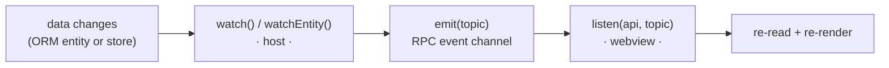

By default a webview reads data once (on mount) and on focus. **Reactivity** lets
a visual element track a value and update the moment it changes — no manual
refresh.

The model is two explicit, symmetric halves:

- **On the host you `watch` a source** and push a change event.
- **In the webview you `listen` for that event** and react.



There are two kinds of source.

## 1. ORM entities

Every mutation on an entity (`insert`, `upsert`, `update`, `delete`,
`deleteMany`, `clear`) fires a change. Subscribe with `watchEntity` from your
generated `db.ts`.

```ts title="src/subpanels/todoStats.ts" {2,3,7}
import { defineSubpanel } from '../shared/vsceasy';
import { Todos, TodosRepo } from '../models/Todo';
import { watchEntity } from '../helpers/db';

export default defineSubpanel<TodoStatsViewApi>({
  title: 'Stats',
  menu: 'todos',
  rpc: (vscode, ctx, emit) => {
    // SUBSCRIBE: any Todo change pushes an event to this webview.
    watchEntity(Todos, () => emit('todos:changed'));

    return {
      async stats() {
        const todos = await TodosRepo().findMany();
        return { total: todos.length, done: todos.filter((t) => t.done).length };
      },
    };
  },
});
```

The `rpc` factory receives a third argument, `emit` — that's how a handler pushes
an event to its own webview.

## 2. Stores

A store is a single observable value for arbitrary, non-ORM state (a counter, a
flag, a selection). Create one with `vsceasy store add`, or by hand:

```ts title="src/stores/badgeCount.ts"
import { defineStore } from '../shared/vsceasy';

export const badgeCount = defineStore<number>(0);
```

Mutate it anywhere on the host and `watch` it the same way:

```ts
import { watch } from '../shared/vsceasy';
import { badgeCount } from '../stores/badgeCount';

// in a panel/subpanel rpc():
rpc: (vscode, ctx, emit) => {
  watch(badgeCount, () => emit('badge:changed', badgeCount.get()));
  return { /* … */ };
}

// then anywhere a command runs:
badgeCount.set(3);
badgeCount.update((n) => n + 1);
```

`defineStore` gives you `get()`, `set(v)`, `update(fn)`, and `subscribe(cb)`.
`set` is a no-op when the value is unchanged (`Object.is`), and `subscribe`
returns an unsubscribe function.

## The webview side — `listen`

Wherever your element should react, call `listen(api, topic, cb)`. It's a thin,
named wrapper over the RPC event channel so the place you listen reads clearly.

```tsx title="src/webview/subpanels/todoStats/App.tsx" {2,11}
import { connectWebview, listen } from '../../../shared/vsceasy/client';

const api = connectWebview<TodoStatsViewApi>();

export function App() {
  const [s, setS] = useState(null);

  useEffect(() => {
    const refresh = () => void api.stats().then(setS);
    refresh();
    // LISTEN: re-read whenever the host says todos changed.
    return listen(api, 'todos:changed', refresh);
  }, []);
  // …
}
```

`listen` returns an unsubscribe function — return it from `useEffect` (or call it
on teardown) so the subscription is cleaned up.

:::note[Framework-agnostic]
`listen` just runs your callback — it has no opinion about React. In plain JS
the body is `el.textContent = …`; in React it's `setState`. The reactivity layer
is the same either way.
:::

## Cleanup

`watchEntity`, `watch`, and `store.subscribe` all return an unsubscribe function.
On the host, the panel's RPC server is disposed when the webview closes, which
tears down the event channel; for long-lived subscriptions push the unsubscribe
onto `ctx.subscriptions` wrapped in `{ dispose }`. In the webview, return the
`listen` result from your effect.

## When to reach for it

- A summary/stat view that must track a list it doesn't own (the canonical case).
- A badge or status indicator bound to a store.
- Any element that would otherwise need a manual "Refresh" button to stay correct.

For a list that already reloads on focus (like the generated CRUD list),
reactivity is optional polish; for a sibling panel that must mirror another, it's
the clean fix.
