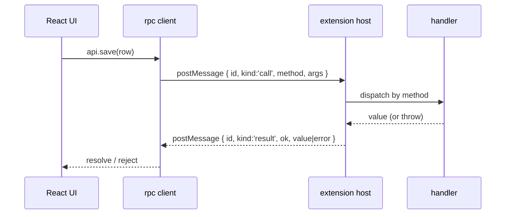

vsceasy panels and subpanels talk to the extension over a typed RPC bridge. You
define one interface; both sides are typed from it. No manual `postMessage`.

## The contract

```ts title="src/shared/api.ts"
import type { User } from '../models/User';

export interface UsersApi {
  list(): Promise<User[]>;
  get(id: string): Promise<User | null>;
  save(row: User): Promise<User>;
}
```

## The handlers (extension side)

```ts title="src/panels/users.ts"
import { definePanel } from '../shared/vsceasy';
import type { UsersApi } from '../shared/api';
import { UserService } from '../services/UserService';

export default definePanel<UsersApi>({
  title: 'Users',
  rpc: (vscode, context) => ({
    async list() {
      return UserService.list();
    },
    async get(id) {
      return UserService.get(id);
    },
    async save(row) {
      const saved = await UserService.save(row);
      void vscode.window.showInformationMessage(`Saved ${saved.id}`);
      return saved;
    },
  }),
});
```

## The client (webview side)

```tsx title="src/webview/panels/users/App.tsx"
import { connectWebview } from '../../../shared/vsceasy/client';
import type { UsersApi } from '../../../shared/api';

const api = connectWebview<UsersApi>();

const rows = await api.list();       // User[]
const saved = await api.save(row);   // User
```

Add methods incrementally with [`rpc add`](/commands/rpc-add/).

## How it works

Transport is `webview.postMessage` + `acquireVsCodeApi`. The protocol:

```text
{ id, kind: 'call',   method, args }
{ id, kind: 'result', ok: true,  value }
{ id, kind: 'result', ok: false, error: { message, stack? } }
```



## Webview gotchas

- `confirm()` / `alert()` are **disabled** in webviews. Confirm in the host via
  `showWarningMessage({ modal: true }, …)` instead.
- Webviews keep state when hidden (`retainContextWhenHidden`). To refresh on
  reveal, listen for `focus` / `visibilitychange` and re-fetch.

Both gotchas are already handled in the [CRUD](/guides/crud/) scaffold.
