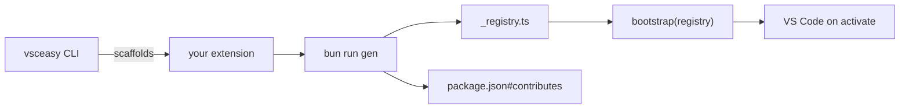

vsceasy is a CLI that scaffolds and grows VS Code extensions. It is **codegen**,
not a runtime you ship — your extension has no dependency on vsceasy at run time.
The CLI writes plain TypeScript + React into your project; you own and edit it.

## What you get

- **File-based routing.** One file per panel, command, menu, tree view,
  subpanel, or status bar item. A `gen` step scans the convention directories and
  writes `src/extension/_registry.ts` plus `package.json#contributes`.
- **Typed RPC.** A single interface in `src/shared/api.ts` types both the
  extension handlers and the webview client. Call `api.method(...)` — no manual
  message plumbing.
- **React webviews.** Panels and subpanels render React, themed with VS Code CSS
  variables. Optional UI templates (`form`, `list`, `dashboard`) start you from a
  working screen.
- **A mini-ORM.** `db init` + `model add` give you typed entities with a
  filesystem-backed store. `crud add` scaffolds a full list + form UI over a model.
- **Operational helpers.** Jobs (interval / daily / event / file watch), runtime
  helpers (secrets, config, state, notifications), a test harness, and publish
  tooling.

## When to use it

Reach for vsceasy when you're building a webview-heavy extension and want to skip
the boilerplate: panel registration, the RPC bridge, the build pipeline, and the
`contributes` bookkeeping. You stay in plain VS Code APIs everywhere it matters —
vsceasy just removes the repetitive wiring.

## How it fits together

Next: [Quick start](/quick-start/) to scaffold a project, or
[Concepts](/concepts/) for the mental model.
