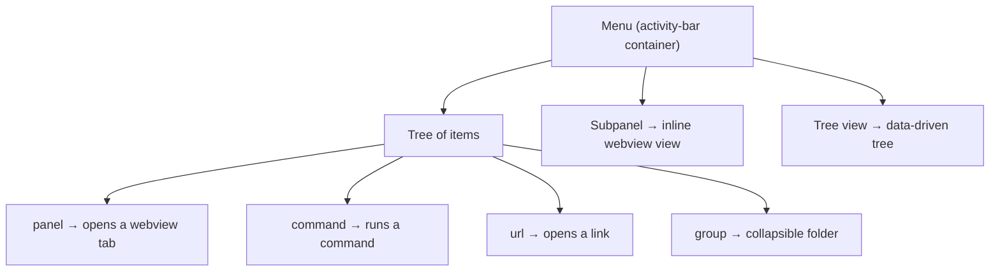

So far `crud add` created a menu for us (`--menu new:todos`). Now we'll build one
by hand and learn the model behind it — because **the menu is how everything in a
vsceasy extension connects**.

## The mental model

A **menu** is one icon in VS Code's activity bar (the left strip) and the
container that opens when you click it. Everything the user reaches lives under a
menu:



A menu holds two distinct things:

1. **A tree of navigation items** — each item *points at* something by id: a
   `panel`, a `command`, a `url`, or a `group` of nested items. The menu never
   contains the panel or command; it only references it. That indirection is the
   whole idea — panels and commands don't know about menus, and you can wire the
   same panel into several menus.
2. **Attached views** — subpanels (inline webviews) and tree views render
   *inside* the same container, below the item tree. (Covered in the next step.)

## Create a menu

```bash
vsceasy menu add --name tools --title "Tools" --icon tools
```

```text
✓ Menu "tools" added.

  Created:
    + src/menus/tools.ts

  Registry + package.json updated.
```

The generated file is a skeleton with two empty groups:

```ts title="src/menus/tools.ts"
import { defineMenu } from '../shared/vsceasy';

export default defineMenu({
  title: 'Tools',
  icon: 'tools',
  items: [
    { label: 'Panels', children: [ /* … */ ] },
    { label: 'Actions', children: [ /* … */ ] },
  ],
});
```

## Wire items into it

`menu edit` adds one item at a time. The `--kind` flag picks what the item points
at:

```bash
# a panel link — opens the Todos list webview
vsceasy menu edit --name tools --kind panel \
  --panel todosList --label "All Todos" --icon list-unordered --group Panels

# a command — runs the hello command
vsceasy menu edit --name tools --kind command \
  --command hello --label "Say Hello" --icon play --group Actions

# a url — opens an external link
vsceasy menu edit --name tools --kind url \
  --url "https://vsceasy.dev" --label "Docs" --icon book --group Actions
```

The file now shows the three connection types side by side:

```ts title="src/menus/tools.ts"
export default defineMenu({
  title: 'Tools',
  icon: 'tools',
  items: [
    {
      label: 'Panels',
      children: [
        { label: 'All Todos', icon: 'list-unordered', panel: 'todosList' },
      ],
    },
    {
      label: 'Actions',
      children: [
        { label: 'Say Hello', icon: 'play', command: 'hello' },
        { label: 'Docs', icon: 'book', url: 'https://vsceasy.dev' },
      ],
    },
  ],
});
```

### The item kinds

| Field on the item | What clicking it does |
| ----------------- | --------------------- |
| `panel: 'id'` | Opens that panel (a webview tab in the editor area). |
| `command: 'id'` | Runs that command's `run()` handler. |
| `url: 'https://…'` | Opens the link in the browser. |
| `children: [ … ]` | A group — collapses/expands; holds nested items. |
| `run: (vscode, ctx) => …` | Inline handler, for one-off logic without a separate command. |

`icon`, `description`, and `collapsed` are optional on any item.

## What gen writes

`bun run gen` turns every `src/menus/*.ts` into VS Code's `contributes`. For our
two menus (`tools` and the CRUD-generated `todos`) it produced:

```json title="package.json (excerpt)"
"viewsContainers": {
  "activitybar": [
    { "id": "tododemo-tools", "title": "Tools", "icon": "$(tools)" },
    { "id": "tododemo-todos", "title": "Todos", "icon": "$(symbol-misc)" }
  ]
},
"views": {
  "tododemo-tools": [ { "id": "tododemo-tools", "name": "Tools" } ],
  "tododemo-todos": [ { "id": "tododemo-todos", "name": "Todos" } ]
}
```

- Each menu becomes one **activity-bar container** with id `<prefix>-<menuId>`.
- The icon string becomes `$(codicon)` form.
- The item tree itself is rendered at runtime by a `TreeDataProvider`, not baked
  into `package.json` — so you change items by editing the `.ts` file and
  re-running `gen`, never by hand-editing JSON.

## See it run

The `todos` menu (built by `crud add`) shows its item tree in the activity bar —
the `Todos` and `New Todo` items point at the `todosList` and `todoForm` panels:


## Why the indirection matters

Because items reference targets by id:

- The same `todosList` panel is reachable from the `todos` menu **and** the
  `tools` menu — define once, link anywhere.
- Renaming or restyling a menu never touches the panels.
- A command can be triggered from the command palette, a menu item, a status bar
  item, or a tree node — all pointing at the same `command: 'id'`.

This is the backbone for the next two steps: the **status bar** item and the
**sidebar views** both plug into this same id-reference model.

Next: [add a status bar item →](/tutorial/06-statusbar/)
